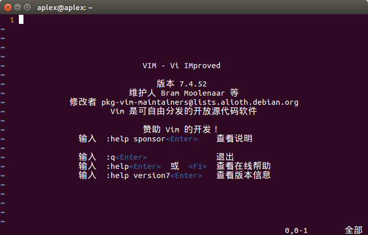

# Vim 文本编辑器

## 简介

这个软件存在也是相当的久远了，相关信息在网络上随处可查，这里就不具体去列出来，可以自行看维基百科[Vim](https://zh.wikipedia.org/wiki/Vim)

## 个人体会

到目前为止，我自己使用的电脑上几乎都是使用Vim：

* Windows使用GVim；
* Linux使用Vim；
* 浏览器（Chrome）使用Vim插件。

当然我并没有去尝试使用emacs，我也不清楚他们的区别，就目前而言，我只知道我离不开Vim，否则，我将无法编辑，因为我会下意识去按那个ESC键。:)
